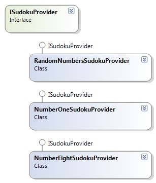
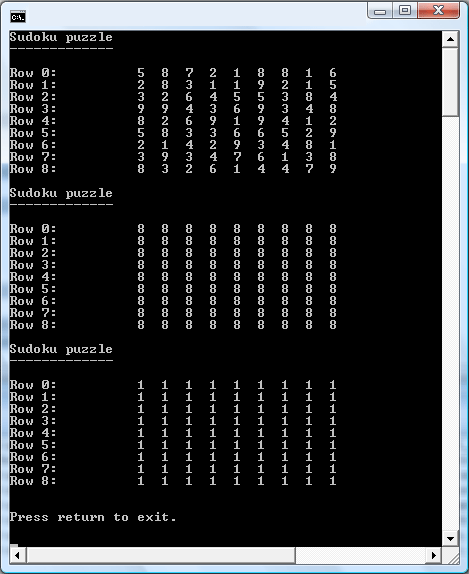

# Strategy Pattern

## Introduction

This week I was at last able to find some spare time to write a new article. It's been three months already since the last one. I've been preoccupied with studying for .NET exams (MCTS) among other things hence the delay.

To get back on track I thought I'd finish an article for which I've had the code lying around for quite some time. This article is the second one in the Sudoku series. This series explains a couple of design patterns using a Sudoku game as an example. You can find the first article, which details the Flyweight pattern [here](https://github.com/geersch/FlyweightPattern). Be sure to take a look at it and download its source code.

Let's get started with the design pattern at the heart of this article, namely the Strategy pattern...

## Sudoku Game

Let's shamelessy copy & paste some of the first article's content to briefly explain the Sudoku game.


Sudoku is a number placement puzzle. You are presented with a grid containing 81 cells, distributed in a 9×9 matrix. Apart from 9 rows and 9 columns there are also nine 3×3 boxes (also called blocks or regions). Each row, column and block has to contain the digits 1 to 9 only one time each.

There are three simple rules to obey:

1. You cannot put the same digit in two or more cells of the same row.
2. You cannot put the same digit in two or more cells of the same column.
3. You cannot put the same digit in two or more cells of the same block.

You are presented with a partially filled 9×9 grid to start with. The difficulty of a puzzle is based on the positioning and relevance of the given digits rather than their quantity.

## The Design

First of all take a look at the [design section](https://github.com/geersch/FlyweightPattern) of the first article to discover how different strategy patterns can work together to create a Sudoku game. In order to fill the game board with a partial puzzle we require an algorithm which can calculate a new puzzle on demand.

Now there are scores of ways to derive an algorithm for calculating a Sudoku puzzle which adheres to all of the rules previously stated. I wanted to keep the possibility to quickly change the choosen algorithm and use a new one without affecting the rest of the code. This is where the Strategy pattern comes to the rescue.

## Strategy Pattern

The [Gang of Four](http://en.wikipedia.org/wiki/Design_Patterns) defines this pattern somewhat as follows:

_"The Strategy pattern allows you to define a family of algorithms which can be used interchangeably. The implementation of the algorithms can vary greatly and are are independent of one another."_

Exactly what we need! Basically this means the pattern will allow us to address multiple, non-related algorithms through a common interface. And as is always the case with interfaces, they don't care about the actual implementation. That is left to the classes (or algorithms in this case) which implement the interface.

## Participants

The participants for the Strategy pattern are the following:

- **Compositor or Strategy**: The Compositor is the interface that the client uses to call into the algorithm classes that implement it. In .NET, be it C# or VB.NET, it is nothing more than a simple interface type. I usually refer to this as the Strategy interface.
- **Concrete Strategy**: The afore mentioned algorithm classes that implement the Strategy interface and provide the actual implementation.
- **Context**: Is the conduit between the Strategy interface and one of the Concrete Strategy classes. It contains a reference to an implementation of the algorithm through the Strategy interface. It knows nothing about the actual implementation behind it. In this example the Context is provided by the Sudoku grid (SudokuGrid class) itself. You can opt to enable two-way communication between the Context and Concrete Strategy if you want to allow the algorithm to access the Context's data.

## Compositor / Strategy Interface

In short if you don't want to embed or "pollute" your code with a complex algorithm that may be hard to adjust or extract afterwards opt for a Strategy pattern to encapsulate this algorithm. The client communicates with the algorithm through a fixed, predefined interface which is implemented by any algorithm you might want to add. So you can easily swap out algorithms.

The Strategy interface for the Sudoku game consists out of two methods as shown in Listing 1.

**Listing 1** - ISudokuProvider Interface

```csharp
namespace CGeers.Sudoku
{
    public interface ISudokuProvider
    {
        void NewGame(int dimension);
        int ValueForCell(int row, int column);
    }
}
```

The first method NewGame(int dimension) indicates the dimension of the Sudoku grid. Pass in 3 for a 3x3 grid for example. After calling this method the algorithm should calculate values for each cell in the grid that together form a valid Sudoku puzzle. The last method ValueForCell(int row, int column) allows you to retrieve the value for a specific cell.

The class representing the Sudoku grid contains a reference to this Strategy interface. When starting a new game it only needs to call the NewGame method and then enumerate its cell and retrieve their values through the ValueForCell method. The reference only needs to point to a valid implementation of the Strategy interface.

## Concrete Strategy

For brevity's sake this article will not discuss how to generate a valid Sudoku puzzle. There are a bunch of algorithms out there so just use your favorite search engine ([CodeProject](http://www.codeproject.com/) contains quite a few of articles articles on this subject). Our algorithm instead will just generate a bunch of random numbers to fill the Sudoku puzzle board.

**Listing 2** - RandomNumbersSudokuProvider Class

```csharp
using System;

namespace CGeers.Sudoku
{
    public class RandomNumbersSudokuProvider : ISudokuProvider
    {
        private int[,] grid;

        #region ISudokuProvider Members

        public void NewGame(int dimension)
        {
            grid = new int[dimension, dimension];

            Random random = new Random();
            for (int i = 0; i < 9; i++)
            {
                for (int j = 0; j < 9; j++)
                {
                    grid[i, j] = random.Next(1, 10);
                }
            }
        }

        public int ValueForCell(int row, int column)
        {
            if (grid != null)
            {
                return grid[row, column];
            }
            else
            {
                throw
                    new InvalidOperationException
                        ("Please call the NewGame(int dimension) method first to initialize the game.");
            }
        }

        #endregion
    }
}
```

The algorithm shown in Listing 2 generates a bunch of random numbers. The implementation provided by the RandomNumbersSudokuProvider class is kept simple to keep the focus on the design pattern instead of on an actual implementation for generating a Sudoku puzzle. That is beyond the scope of this article.

As you can see the class contains a two-dimensional array consisting out x elements. The NewGame(int dimension) method has to be called first to initialize this array. If you pass in 9 you'll wind up with an array consisting out of 81 elements (9 x 9). Just enough to provide the contents for a default Sudoku puzzle. It then proceeds to fills each element of the array with a random number from the range 1 - 9. The ValueForCell(int row, int column) allows you to retrieve these values for a specific cell. Feel free to improve on this dummy algorithm or provide one of your own using one of the articles on [CodeProject](http://www.codeproject.com/).

## Context

As long as your algorithm implements the ISudokuProvider interface you'll be able to provide it to the context so that it can use this algorithm to generate a new puzzle. You can develop any number of algorithms this way and use them interchangeably without affecting the rest of the code.

Consider the following listing.

**Listing 3** - Sudoku Algorithm Providers Class Diagram



Any of the classes implementing the ISudokuProvider interface can be provided to the context. Usually you instantiate an instance of a Concrete Strategy and pass it to the context. Afterwards you only communicate with the context which in turn delegates the generation of the puzzle to the provided strategy. Take a look at the following listing to see the Context in action. Don't fret about the code, it isn't optimal, but suffices for the purpose of this article.

**Listing 4** - The Context

```csharp
using System;
using System.Text;
using System.Globalization;

namespace CGeers.Sudoku
{
    public class SudokuGrid
    {
        private static int dimension = 9;

        private int[,] cells = new int[dimension, dimension];

        public ISudokuProvider SudokuProvider { get; set; }

        public void NewGame()
        {
            if (SudokuProvider != null)
            {
                SudokuProvider.NewGame(dimension);
                for (int row = 0; row < dimension; row++)
                {
                    for (int column = 0; column < dimension; column++)
                    {
                        cells[row, column] = SudokuProvider.ValueForCell(row, column);
                    }
                }
            }
            else
            {
                throw new InvalidOperationException("Please specify a Sudoku Provider.");
            }
        }

        public override string ToString()
        {
            StringBuilder result = new StringBuilder();
            result.Append("Sudoku puzzle\n");
            result.Append("-------------\n\n");
            for (int row = 0; row < dimension; row++)
            {
                result.Append("Row " + row.ToString() + ":\t\t");
                for (int column = 0; column < dimension; column++)
                {
                    result.Append(String.Format(CultureInfo.InvariantCulture,
                        "{0}  ", cells[row, column]));
                }
                result.Append("\n");
            }

            return result.ToString();
        }
    }
}
```

Listing 4 lists the code for the context, the SudokuGrid class, which contains a property of the type ISudokuProvider. It is up to the user of this class to provide a valid implementation of this interface. The NewGame() method in turn communicates with the Concrete Strategy through the ISudokuProvider interface and extracts values for a new puzzle. The overriden ToString() method displays the generated puzzle as you will see in the next section.

## Client

Now to see it all in action let's create a simple Console application. Be sure to add a reference to the assembly containing the above types. All that is required now is adding the code shown in Listing 5.

**Listing 5** - The Client

```csharp
using System;
using CGeers.Sudoku;

namespace SudokuConsoleApplication
{
    class Program
    {
        private static void GeneratePuzzle(SudokuGrid sudokuGrid,
            ISudokuProvider sudokuProvider)
        {
            sudokuGrid.SudokuProvider = sudokuProvider;
            sudokuGrid.NewGame();
            Console.WriteLine(sudokuGrid.ToString());
        }

        static void Main()
        {
            SudokuGrid sudokuGrid = new SudokuGrid();

            // Geneate a puzzle populated with random numbers.
            GeneratePuzzle(sudokuGrid, new RandomNumbersSudokuProvider());

            // Generate a puzzle populated with the number eight.
            GeneratePuzzle(sudokuGrid, new NumberEightSudokuProvider());

            // Generate a puzzle populated with the number one.
            GeneratePuzzle(sudokuGrid, new NumberOneSudokuProvider());

            Console.WriteLine("\n\rPress return to exit.\n\r");
            Console.ReadLine();
        }
    }
}
```

The application generates three puzzles using the same instance of the SudokuGrid class. However each time a different implementation of the ISudokuProvider interface is provided. Your output should be simular to the following image. Ofcourse the RandomNumbersSudokuProvider will generate different numbers when you run it.

**Listing 6** - Output



## Summary

Use the Strategy pattern when you need to encapsulate different algorithms. It it ideal for this situation as it enables you to interchangeably use the algorithms without affecting the rest of the code. The simple console application in this article which acts as the client hardcodes which concrete strategies are used, but you are free to incorporate this information in a configuration file (App.config). In that case you don't even need to recompile the application if you want to use a different algorithm.
